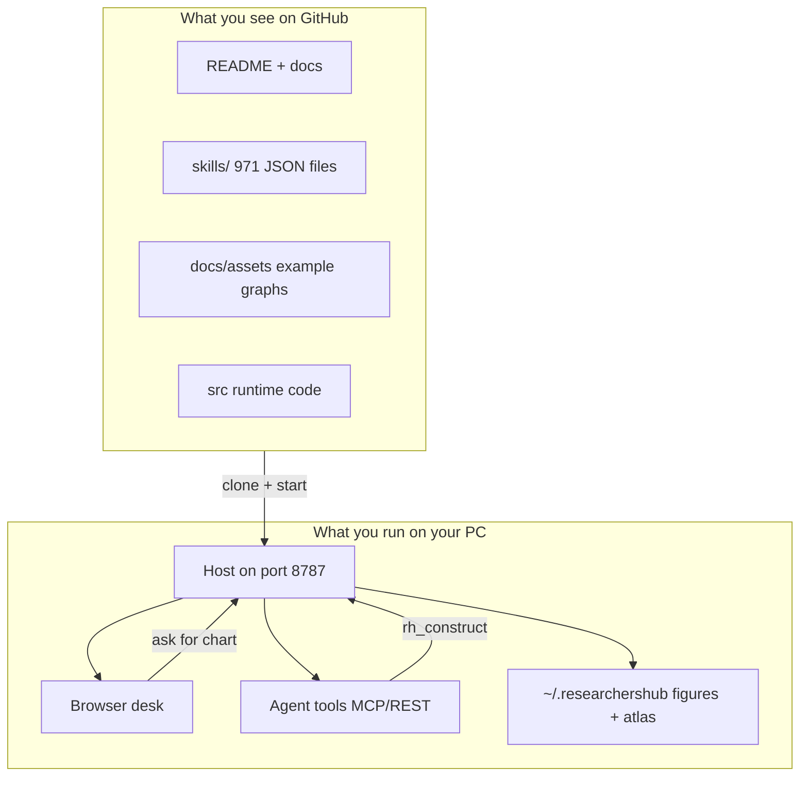
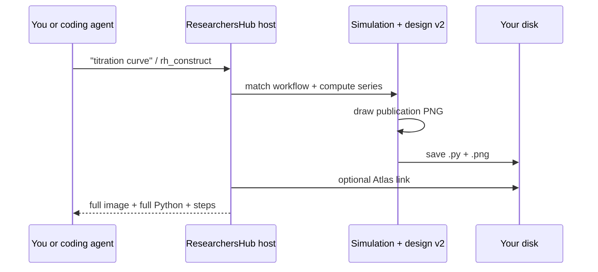
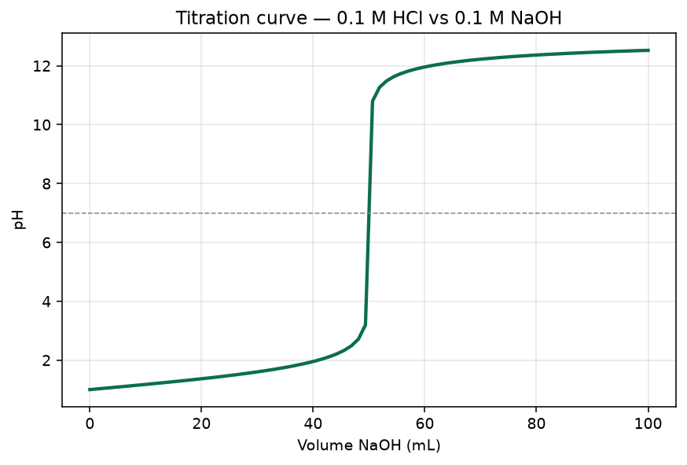
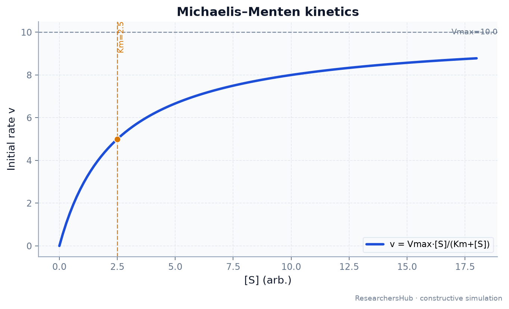
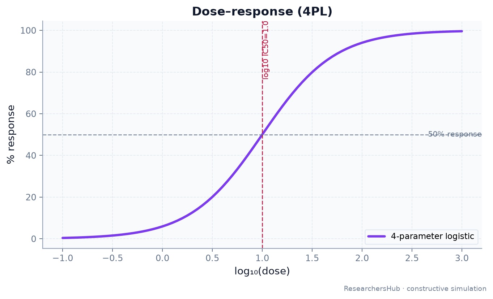
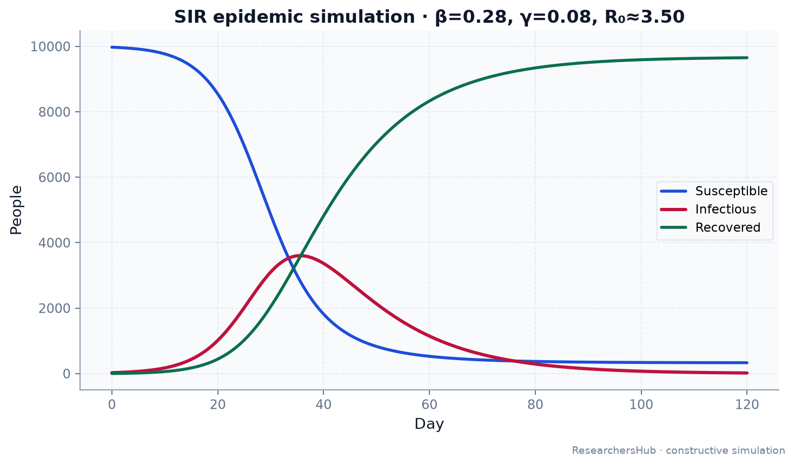
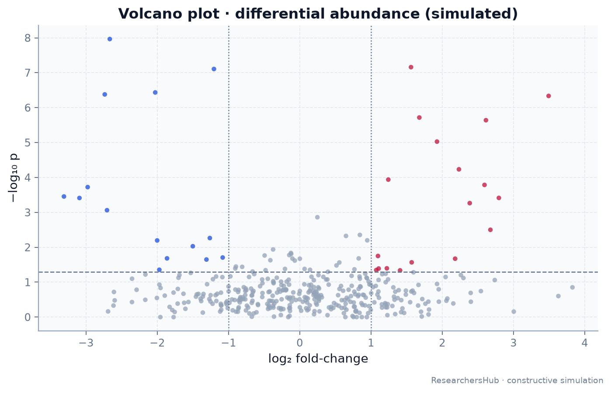
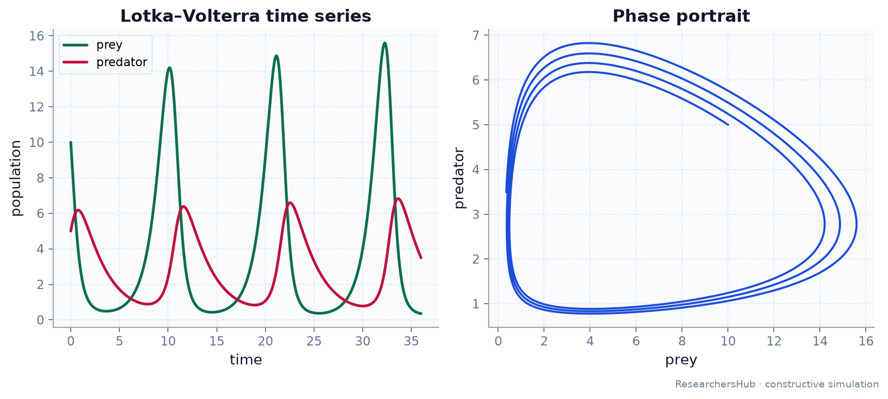
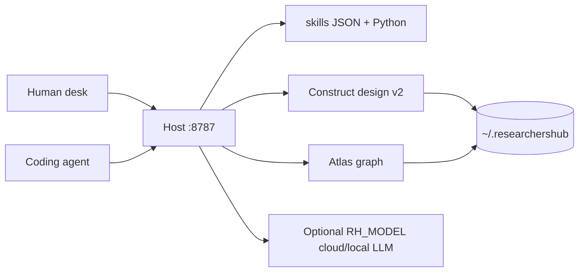

<p align="center">
  
</p>

<p align="center">
  <strong>Your local research server</strong> — skills, real charts, real Python, on your machine.<br/>
  Humans use a desk in the browser. Coding agents call the same host with tools.
</p>

<p align="center">
  <a href="https://github.com/ItsNotAILABS/ResearchersHub"></a>
  <a href="docs/HOW_TO_USE.md"></a>
  <a href="skills/"></a>
</p>

<p align="center">
  
  
  
  
</p>

---

## Read this first (so the repo makes sense)

| Question | Answer |
|----------|--------|
| **What is it?** | A **program you run locally** — not a SaaS you only visit |
| **Who is it for?** | Scientists **and** people whose coding agents help with research |
| **What do I see on GitHub?** | Product docs, **971 skills as JSON**, example graphs, source code |
| **What do I see when running?** | Browser desk at `http://127.0.0.1:8787/desk` + files under `~/.researchershub/` |
| **How do agents use it?** | They call **tools** on that same host (MCP or HTTP) — same charts/skills |
| **What happens when I ask for a plot?** | Host simulates → draws PNG → writes Python → returns both (design v2) |

**Full plain-language guide:** **[docs/HOW_TO_USE.md](docs/HOW_TO_USE.md)**



---

## 60-second start (human)

```powershell
git clone https://github.com/ItsNotAILABS/ResearchersHub.git
cd ResearchersHub
pip install -r requirements-researchers.txt
$env:PYTHONPATH = "$PWD\src"
python -m pocket serve --host 127.0.0.1 --port 8787
```

Open: **http://127.0.0.1:8787/desk**

> Note: commands say `python -m pocket` because the **package folder** is `src/pocket` (legacy name).  
> The **product name** is always **ResearchersHub**.

One figure with no UI:

```powershell
curl -s -X POST http://127.0.0.1:8787/v1/researchers/construct `
  -H "content-type: application/json" `
  -d "{\"prompt\":\"titration curve\"}"
```

---

## What happens when you ask for a graph



| Step | Result |
|------|--------|
| 1 | Intent matched (titration, IC50, SIR, workflow name, …) |
| 2 | Numbers simulated on **your** machine |
| 3 | Figure drawn with **design system v2** (branded, annotated) |
| 4 | Script + PNG written under `~/.researchershub/construct/` |
| 5 | Reply includes **whole PNG** + **runnable Python** (not a stub) |

---

## How coding agents use it

Agents talk to the **same host** you started. They never need a special “Grok folder” in the public repo.

| Method | How |
|--------|-----|
| **REST** | `POST http://127.0.0.1:8787/v1/agents/invoke` with `{"name":"rh_construct","arguments":{"prompt":"…"}}` |
| **MCP** | `python -m pocket mcp` then use tools `rh_*` |
| **List skills** | tool `rh_skills_list` or `GET /v1/researchers/skills` |
| **Record result** | tool `rh_atlas_claim` |

```bash
curl -s http://127.0.0.1:8787/v1/agents/invoke \
  -H "content-type: application/json" \
  -H "X-Agent-Name: my-agent" \
  -d "{\"name\":\"rh_construct\",\"arguments\":{\"prompt\":\"dose-response IC50\"}}"
```

**Agent gets back:** markdown + base64 PNGs + full Python + workflow steps.  
**Human sees:** whatever the agent UI shows (chat with image + code).

Optional IDE notes only: [docs/developers/](docs/developers/) · contract: [AGENTS.md](AGENTS.md)

---

## What’s in this repository (files that make sense)

**Full map:** **[FILES.md](FILES.md)**

| Path | Purpose |
|------|---------|
| **[FILES.md](FILES.md)** | **Every folder explained** |
| **[docs/HOW_TO_USE.md](docs/HOW_TO_USE.md)** | What you see / what agents do / what happens |
| **[skills/](skills/)** | **971 research skills as JSON** |
| **[docs/assets/](docs/assets/)** | Example graphs from the engine |
| **[src/](src/)** | Runtime (`python -m pocket serve`) — see `src/README.md` |
| **[scripts/](scripts/)** | Start host / open desk / export skills |
| **[scripts/legacy/](scripts/legacy/)** | Old host scripts — **ignore** |
| **[optional/](optional/)** | Electron / vendor extras — **not required** |
| **[docs/archive/](docs/archive/)** | Historical papers — **not current product** |

There is **no** public `.grok` folder. Private AI-tool config stays on your machine only.

---

## Skills (yes — they are here)

| File | What you open on GitHub |
|------|-------------------------|
| [skills/CATALOG.json](skills/CATALOG.json) | Counts by domain |
| [skills/INDEX.json](skills/INDEX.json) | Every skill id + description |
| [skills/catalog/](skills/catalog/) | Full domain packs (ml, compbio, cheminformatics, …) |

```http
GET /v1/researchers/skills
```

---

## Use cases

| Who | They do this | They get |
|-----|--------------|----------|
| Chemist | Ask titration / Arrhenius / spectrum | Full curve + Python |
| Biochem / pharma | IC50, Michaelis–Menten, binding | Annotated plots + scripts |
| Comp bio / omics | Volcano, PCA-style map, skill checklists | Figures + skill JSON |
| ML / stats | Regression residuals, distributions | Dual-panel diagnostics |
| Lab lead | Multi-step workflows (`pk_pd_panel`, …) | Bundled figure sets |
| Coding agent | `rh_construct` / `rh_skills_list` | Same artifacts via tools |

Named workflows: `GET /v1/researchers/workflows`  
Examples: `assay_standard_curve`, `pk_pd_panel`, `epidemic_scenario`, `omics_hits`, `full_methods_bundle`, …

---

## Example figures (from the live engine)

<p align="center">
  
  
</p>
<p align="center">
  
  
</p>
<p align="center">
  
  
</p>

---

## Architecture (runtime)



Optional models (`RH_MODEL=claude|grok|gpt|…`) need **your** API keys.  
Charts and simulations work **without** any cloud model.

---

## API cheat sheet

| Call | Purpose |
|------|---------|
| `GET /health` | Is host up? |
| `GET /v1/researchers` | Product identity |
| `GET /v1/researchers/skills` | Skill catalog |
| `GET /v1/researchers/workflows` | Named multi-step workflows |
| `POST /v1/researchers/construct` | Figures + Python |
| `GET /v1/agents/manifest` | Tool list for agents |
| `POST /v1/agents/invoke` | Run a tool by name |

More: [docs/API_QUICKSTART.md](docs/API_QUICKSTART.md)

---

## Docs map

| Doc | For |
|-----|-----|
| **[FILES.md](FILES.md)** | **File/folder map** |
| **[docs/HOW_TO_USE.md](docs/HOW_TO_USE.md)** | What you see & what happens |
| [PRODUCT.md](PRODUCT.md) | Product definition |
| [docs/REPO_LAYOUT.md](docs/REPO_LAYOUT.md) | Layout rules |
| [docs/CODING_AGENTS.md](docs/CODING_AGENTS.md) | Agent integration |
| [docs/SECURITY.md](docs/SECURITY.md) | Security |
| [SHIP.md](SHIP.md) | Ship checklist |

---

## Project

| | |
|--|--|
| **Org** | [ItsNotAILABS](https://github.com/ItsNotAILABS) |
| **Repo** | [ItsNotAILABS/ResearchersHub](https://github.com/ItsNotAILABS/ResearchersHub) |
| **Lab** | ItsNotAI Labs |
| **Version** | 1.2.1 |

<p align="center">
  <sub>ResearchersHub · your infra · your data · real figures</sub>
</p>
