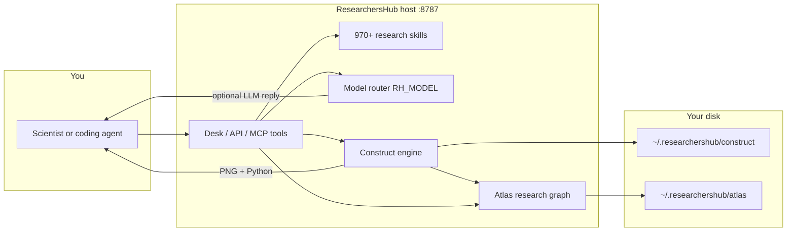
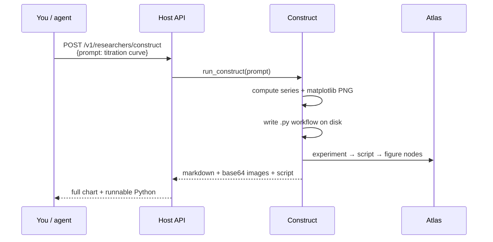
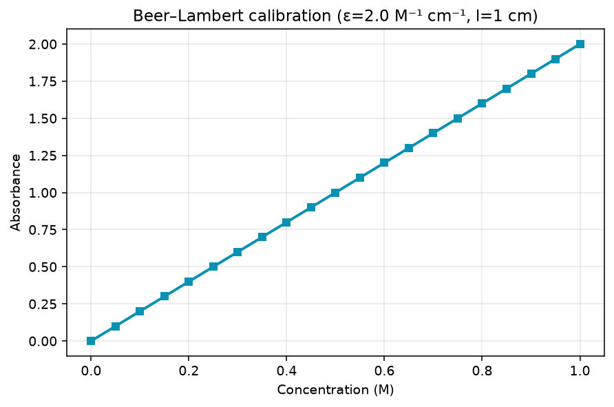
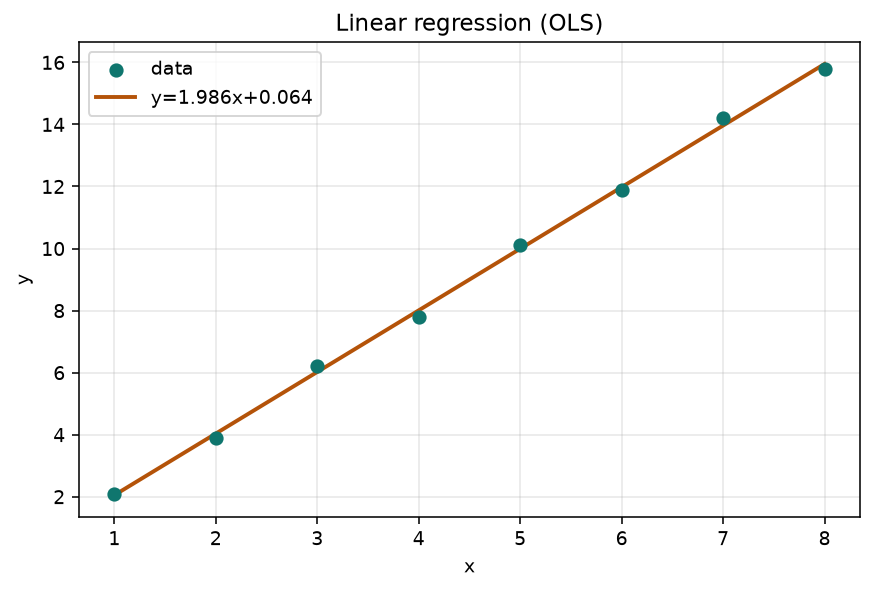
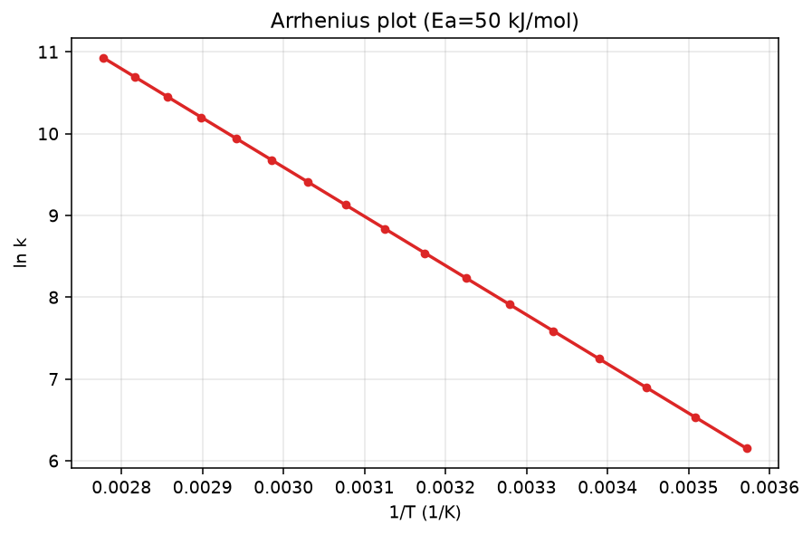
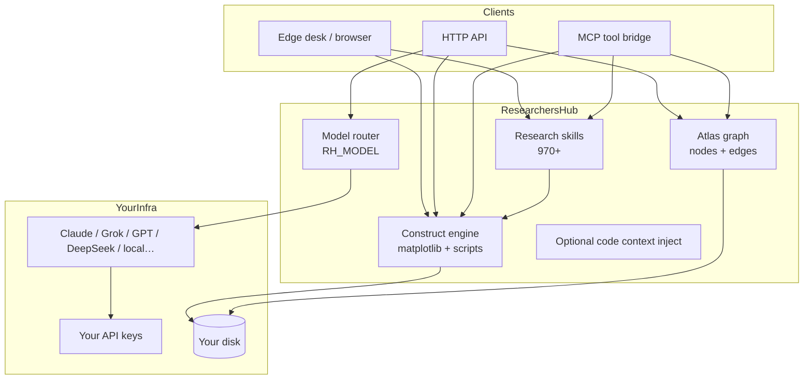
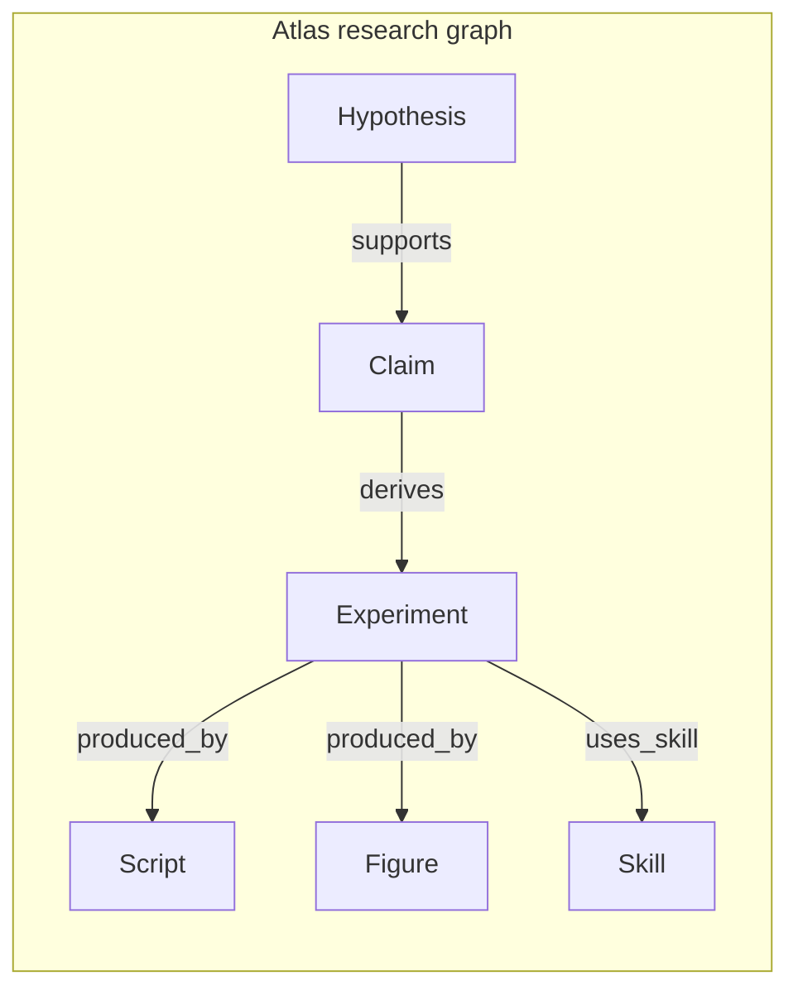

<p align="center">
  
</p>

<p align="center">
  <strong>Sovereign research desk for scientists — and every coding agent</strong><br/>
  Any model · <b>970+ research skills</b> · Atlas graph · MCP for Claude / Grok / Codex / Cursor<br/>
  Full figures + real Python · Your infra — your data
</p>

<p align="center">
  <a href="https://github.com/ItsNotAILABS/ResearchersHub"></a>
  <a href="https://github.com/ItsNotAILABS/ResearchersHub/stargazers"></a>
  <a href="LICENSE"></a>
  <a href="https://github.com/ItsNotAILABS/ResearchersHub/releases"></a>
</p>

<p align="center">
  
  
  
  
  
  
  
</p>

<p align="center">
  
  
</p>

---

## What you get

| Pillar | Detail |
|--------|--------|
| **Any model** | Claude · Grok · GPT · Codex · DeepSeek · GLM · Kimi · fine-tune · local — **one flag** (`RH_MODEL`) |
| **970+ skills** | ML · comp bio · cheminformatics · clinical · materials · neuroscience · earth · chemistry · Atlas agents |
| **Editable** | Plain Python catalogs + JSON drops in `skills/` — readable, forkable, extensible |
| **Full figures** | Chats/construct return **complete PNG charts** + **runnable Python**, not placeholders |
| **Native Atlas** | Many agents, **one shared reproducible research graph** on your disk |
| **Coding agents** | MCP stdio + REST tools for Claude, Grok, Codex, Cursor, Copilot, Gemini |
| **No gatekeeping** | No platform throttle deciding what science is okay |
| **Your infra** | Runs where you run it. **Your data stays yours.** |

<p align="center">
  
</p>

---

## How it works

ResearchersHub is a **local research host** you run on your machine (or lab server). You (or a coding agent) send a request → the host picks skills / models / construct pipelines → you get **text + full charts + real Python**, and results can land in a shared **Atlas** graph for reproducibility.



### Request path (construct example)



### Day-to-day loop

| Step | What happens |
|------|----------------|
| 1. Start host | `python -m pocket serve` on your infra |
| 2. Open desk or call API | Browser desk, curl, or MCP from a coding agent |
| 3. Ask for science work | Skill search, chat, or construct (“plot IC50…”) |
| 4. Get real artifacts | Full PNG figures + complete Python scripts |
| 5. Keep provenance | Atlas links experiment ↔ script ↔ figure for later agents |

---

## Use cases

| Who | Use case | What ResearchersHub does |
|-----|----------|---------------------------|
| **Organic / analytical chemist** | Titration, Beer–Lambert calibration, kinetics | Full curves + runnable analysis scripts |
| **Biochemist / pharmacologist** | Michaelis–Menten, dose–response / IC50 | Publication-style plots + parameter notes |
| **ML scientist** | Baselines, eval harnesses, regression checks | Skills + construct for residual/fit figures |
| **Comp bio** | RNA-seq / GWAS / scRNA playbooks | 100+ domain skills as editable checklists |
| **Medchem / cheminformatics** | QSAR, docking prep, ADMET filters | Skill catalog + generative/filter playbooks |
| **Clinical stats** | Survival, forest plots, estimands | Skills + figure workflows |
| **Lab lead** | SOPs, ELN entries, multi-person seats | Seat isolation + shared Atlas claims |
| **Coding agent user** | Claude / Cursor / Codex on a paper repo | MCP/REST tools: `rh_construct`, `rh_skills_list`, `rh_atlas_claim` |
| **Sovereign lab** | No vendor throttle on “allowed” science | Your keys, your disk, your models (`RH_MODEL`) |

### Example prompts

```text
Plot a strong-acid / strong-base titration curve and give the full Python workflow.
Fit a Michaelis–Menten curve (Km, Vmax) and save a publication figure.
Dose–response IC50 with Hill slope — chart + script.
UV-Vis Beer–Lambert calibration from concentration series.
Linear regression with residuals for my assay standard curve.
List cheminformatics skills for QSAR and docking prep.
Add an Atlas claim: "Lead series shows IC50 ~ 12 nM in primary screen."
```

---

## Example figures (same engine as the app)

These PNGs are produced by the live **construct** pipeline (`science_construct`) — the same path as desk/API/MCP.

<p align="center">
  
  
</p>
<p align="center">
  <sub>Acid–base titration · Enzyme kinetics (Michaelis–Menten)</sub>
</p>

<p align="center">
  
  
</p>
<p align="center">
  <sub>Dose–response (4PL / IC50) · Beer–Lambert calibration</sub>
</p>

<p align="center">
  
  
</p>
<p align="center">
  <sub>Linear regression (OLS) · Arrhenius plot</sub>
</p>

Generate your own:

```http
POST /v1/researchers/construct
Content-Type: application/json

{"prompt":"Plot a dose–response IC50 curve and give the full Python workflow"}
```

You get: **complete PNG** (embedded + saved) · **full `.py` script** · optional **Atlas** links under `~/.researchershub/`.

---

## Architecture diagram





Many agents (human or coded) write the **same** graph — reproducible handoff without a vendor workspace.

---

## Ship in 60 seconds

```powershell
git clone https://github.com/ItsNotAILABS/ResearchersHub.git
cd ResearchersHub
pip install -r requirements-researchers.txt
$env:PYTHONPATH = "$PWD\src"
python -m pocket serve --host 0.0.0.0 --port 8787
```

| Surface | URL |
|---------|-----|
| **Desk** | http://127.0.0.1:8787/desk |
| **Identity** | http://127.0.0.1:8787/v1/researchers |
| **Skills** | http://127.0.0.1:8787/v1/researchers/skills |
| **Models** | http://127.0.0.1:8787/v1/researchers/models |
| **Atlas** | http://127.0.0.1:8787/v1/researchers/atlas |
| **Agent tools** | http://127.0.0.1:8787/v1/agents/manifest |
| **Health** | http://127.0.0.1:8787/health |

```powershell
# Edge app (Windows)
.\scripts\Open-ResearchersHub-Edge.cmd
```

---

## Coding agents (optional)

ResearchersHub is a **tool host** as well as a research desk. Any agent that can call HTTP or MCP can use it.

| Connect | How |
|---------|-----|
| **MCP** | `python -m pocket mcp` · example: [`docs/developers/mcp.example.json`](docs/developers/mcp.example.json) |
| **REST** | `POST /v1/agents/invoke` |
| **Contract** | [`AGENTS.md`](AGENTS.md) · [`docs/CODING_AGENTS.md`](docs/CODING_AGENTS.md) |
| **IDE notes** | [`docs/developers/`](docs/developers/) (optional — not required for the product) |

```bash
curl -s http://127.0.0.1:8787/v1/agents/invoke \
  -H "content-type: application/json" \
  -H "X-Agent-Name: researcher" \
  -d "{\"name\":\"rh_construct\",\"arguments\":{\"prompt\":\"titration curve with full Python\"}}"
```

**Tools:** `rh_identity` · `rh_skills_list` · `rh_models` · `rh_construct` · `rh_chat` · `rh_atlas_*` · …

```text
python -m pocket serve
python -m pocket mcp
python -m pocket tools
```

---

## One flag — any model

```powershell
$env:RH_MODEL = "claude"     # grok | gpt | codex | deepseek | glm | kimi | finetune | local
$env:ANTHROPIC_API_KEY = "..."   # or XAI_API_KEY / OPENAI_API_KEY / DEEPSEEK_API_KEY / ...

# Fine-tune or private OpenAI-compatible endpoint
$env:RH_MODEL = "finetune"
$env:RH_BASE_URL = "https://your-endpoint/v1"
$env:RH_MODEL_ID = "your-model-id"
$env:RH_API_KEY  = "..."
$env:RH_CHAT_VIA_ROUTER = "1"
```

```http
GET  /v1/researchers/models
POST /v1/researchers/chat
```

---

## 970+ research skills

| Domain | What lives here |
|--------|-----------------|
| **ML / deep learning** | Transformers, RLHF/DPO, RAG, HPO, drift, fairness, deploy |
| **Computational biology** | scRNA, spatial, CRISPR, GWAS, multi-omics |
| **Cheminformatics** | SMILES, QSAR, docking, ADMET, generative molecules |
| **Clinical & stats** | Estimands, survival, adaptive trials, CDISC, KM/forest plots |
| **Materials & physics** | DFT, phonons, battery materials, metrology |
| **Neuroscience · earth · astro** | EEG/fMRI, GIS/climate, photometry |
| **Lab · chemistry · construct** | Kinetics, titration, SOPs, full PNG + Python |
| **Atlas agents** | Shared graph claims, handoffs, repro bundles |

```http
GET /v1/researchers/skills
```

### Editable · extensible

Drop JSON into `skills/`, `~/.researchershub/skills/`, or `$RH_SKILLS_DIR`:

```json
{
  "skills": [
    {
      "id": "custom_lab_assay_template",
      "domain": "custom",
      "desc": "Your assay — edit freely",
      "tags": "custom editable",
      "kind": "playbook"
    }
  ]
}
```

---

## Atlas — many agents, one graph

Shared reproducible research graph on your disk (`~/.researchershub/atlas/` or `$RH_ATLAS_DIR`).

**Nodes:** claim · paper · dataset · experiment · figure · skill · script · hypothesis · molecule · gene · model_run  
**Edges:** supports · refutes · cites · derives · uses_skill · produced_by · replicates

```http
GET  /v1/researchers/atlas
GET  /v1/researchers/atlas/export
POST /v1/researchers/atlas/node
POST /v1/agents/invoke   {"name":"rh_atlas_claim","arguments":{"agent":"grok","title":"…"}}
```

Constructive workflows auto-link **experiment → script → figures**.

---

## Doctrine

```text
✓ Any model — one flag (Claude, Grok, GPT, DeepSeek, GLM, Kimi, fine-tune, local)
✓ 970+ research skills — readable, editable, extensible
✓ No throttling · no gatekeeping · no vendor deciding science
✓ Native Atlas — many agents, one shared research graph
✓ MCP + REST — Claude, Grok, Codex, Cursor, Copilot, Gemini
✓ Runs on your infra — your data stays yours
```

`GET /v1/researchers/doctrine`

---

## API map

| Method | Path | Purpose |
|--------|------|---------|
| GET | `/health` | Liveness |
| GET | `/v1/researchers` | Product identity |
| GET | `/v1/researchers/doctrine` | Pillars |
| GET | `/v1/researchers/models` | Active model + providers |
| GET | `/v1/researchers/skills` | Full skill catalog |
| GET | `/v1/researchers/atlas` | Graph snapshot |
| GET | `/v1/researchers/atlas/export` | Full graph JSON |
| POST | `/v1/researchers/atlas/node` | Agent claim |
| POST | `/v1/researchers/construct` | Figures + Python |
| POST | `/v1/researchers/chat` | Model-routed research chat |
| GET | `/v1/agents/manifest` | Coding-agent tool manifest |
| GET | `/v1/agents/tools` | OpenAI + Anthropic schemas |
| POST | `/v1/agents/invoke` | Invoke tool by name |
| GET | `/v1/agents/help?agent=claude` | Per-agent setup |
| POST | `/v1/ai/chat` | Host chat (router optional) |

---

## Architecture

```text
┌──────────────────────────────────────────────────────────────────┐
│                        ResearchersHub                            │
│         Edge desk · agents · phone · API  (POCKET DNA)           │
├────────────────┬─────────────────────┬───────────────────────────┤
│  model_router  │  970+ research      │  Atlas research graph     │
│  RH_MODEL=*    │  skills (editable)  │  many agents → one graph  │
├────────────────┴─────────────────────┴───────────────────────────┤
│  science_construct → full PNG figures + real Python workflows    │
│  agent_bridge + mcp_server → Claude · Grok · Codex · Cursor …    │
│  your keys · your disk · your infra                              │
└──────────────────────────────────────────────────────────────────┘
```

---

## Repo map

| Path | Role |
|------|------|
| `src/pocket/agent_bridge.py` | Tool catalog + invoke |
| `src/pocket/mcp_server.py` | MCP stdio |
| `src/pocket/model_router.py` | Multi-model one flag |
| `src/pocket/science_skills.py` | Skill merge |
| `src/pocket/research_skills_*.py` | Skill packs |
| `src/pocket/science_construct.py` | Charts + Python |
| `src/pocket/atlas_graph.py` | Shared research graph |
| `skills/researchershub/` | Grok/Claude agent skill |
| `AGENTS.md` · `CLAUDE.md` · `.cursorrules` | Coding-agent contracts |
| `docs/CODING_AGENTS.md` | Per-agent setup |
| `docs/brand/` | Logo + wordmark |

---

## Docs

| Doc | Purpose |
|-----|---------|
| [PRODUCT.md](PRODUCT.md) | Product definition |
| [SHIP.md](SHIP.md) | Ship checklist |
| [docs/REPO_LAYOUT.md](docs/REPO_LAYOUT.md) | Why the public tree looks like this |
| [docs/API_QUICKSTART.md](docs/API_QUICKSTART.md) | API quickstart |
| [docs/AI_API.md](docs/AI_API.md) | Sellable AI API |
| [docs/SECURITY.md](docs/SECURITY.md) | Security |
| [docs/PRODUCTION.md](docs/PRODUCTION.md) | Production |
| [AGENTS.md](AGENTS.md) | Coding-agent contract (optional) |
| [docs/developers/](docs/developers/) | Optional IDE/agent setup notes |
| [docs/LINEAGE.md](docs/LINEAGE.md) | Short heritage note |
| [docs/archive/](docs/archive/) | Historical host papers only |

---

## Brand

| Asset | Path |
|-------|------|
| Mark | [`docs/brand/researchershub-mark.svg`](docs/brand/researchershub-mark.svg) |
| Wordmark | [`docs/brand/researchershub-wordmark.svg`](docs/brand/researchershub-wordmark.svg) |

---

## Project

| | |
|--|--|
| **Org** | [ItsNotAILABS](https://github.com/ItsNotAILABS) |
| **Repo** | [ItsNotAILABS/ResearchersHub](https://github.com/ItsNotAILABS/ResearchersHub) |
| **Lab** | ItsNotAI Labs |
| **Company** | Medina Tech Labs |
| **Version** | **1.2.1** |
| **Lineage** | See [docs/LINEAGE.md](docs/LINEAGE.md) |

Python import path remains `pocket` for host compatibility; the **product name is ResearchersHub**.  
Private AI-tool folders (e.g. local editor config) are **gitignored** and never part of the public product surface.

---

## License

See [`LICENSE`](LICENSE) and [`LICENSE-RESEARCHER.md`](LICENSE-RESEARCHER.md).

---

<p align="center">
  <sub>Built for scientists who refuse vendor lock-in — and agents that ship real work.</sub><br/>
  <b>ResearchersHub</b> · ItsNotAI Labs · <a href="https://github.com/ItsNotAILABS/ResearchersHub">Ship it</a>
</p>
